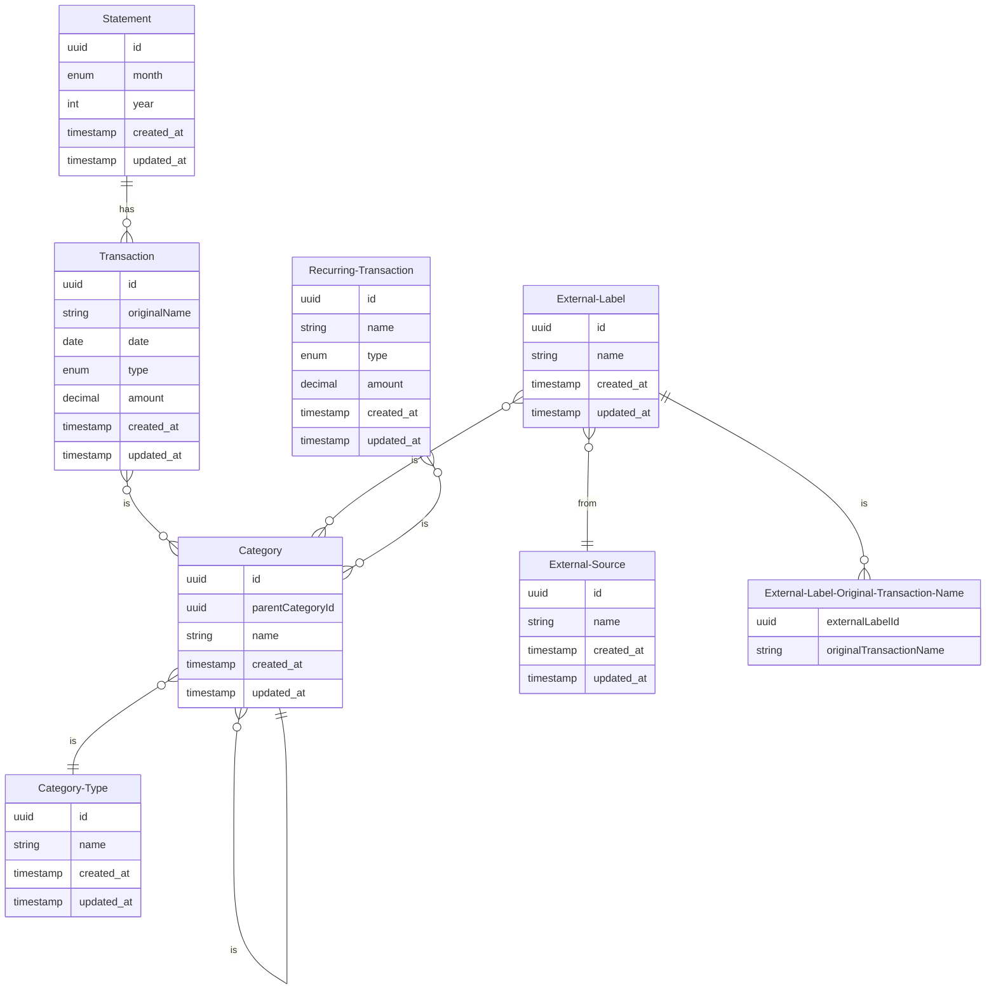

## Requirements

- **JDK 17 or later** (Gradle and Micronaut plugins require JVM 17+; the project is built for Java 21.)
- Set `JAVA_HOME` to your JDK 17+ installation if the build reports a JVM version error.

## Diagram

## Micronaut 4.3.1 Documentation

- [User Guide](https://docs.micronaut.io/4.3.1/guide/index.html)
- [API Reference](https://docs.micronaut.io/4.3.1/api/index.html)
- [Configuration Reference](https://docs.micronaut.io/4.3.1/guide/configurationreference.html)
- [Micronaut Guides](https://guides.micronaut.io/index.html)
---

- [Micronaut Gradle Plugin documentation](https://micronaut-projects.github.io/micronaut-gradle-plugin/latest/)
- [GraalVM Gradle Plugin documentation](https://graalvm.github.io/native-build-tools/latest/gradle-plugin.html)
- [Shadow Gradle Plugin](https://plugins.gradle.org/plugin/com.github.johnrengelman.shadow)
## Feature mockito documentation

- [https://site.mockito.org](https://site.mockito.org)

## Feature graphql documentation

- [Micronaut GraphQL documentation](https://micronaut-projects.github.io/micronaut-graphql/latest/guide/index.html)

## Feature jdbc-hikari documentation

- [Micronaut Hikari JDBC Connection Pool documentation](https://micronaut-projects.github.io/micronaut-sql/latest/guide/index.html#jdbc)

## Feature ksp documentation

- [Micronaut Kotlin Symbol Processing (KSP) documentation](https://docs.micronaut.io/latest/guide/#kotlin)

- [https://kotlinlang.org/docs/ksp-overview.html](https://kotlinlang.org/docs/ksp-overview.html)

## Feature flyway documentation

- [Micronaut Flyway Database Migration documentation](https://micronaut-projects.github.io/micronaut-flyway/latest/guide/index.html)

- [https://flywaydb.org/](https://flywaydb.org/)

## Feature test-resources documentation

- [Micronaut Test Resources documentation](https://micronaut-projects.github.io/micronaut-test-resources/latest/guide/)

## Feature serialization-jackson documentation

- [Micronaut Serialization Jackson Core documentation](https://micronaut-projects.github.io/micronaut-serialization/latest/guide/)

## Feature rxjava3 documentation

- [Micronaut RxJava 3 documentation](https://micronaut-projects.github.io/micronaut-rxjava3/snapshot/guide/index.html)

## Feature data-r2dbc documentation

- [Micronaut Data R2DBC documentation](https://micronaut-projects.github.io/micronaut-data/latest/guide/#dbc)

- [https://r2dbc.io](https://r2dbc.io)

## Feature r2dbc documentation

- [Micronaut R2DBC documentation](https://micronaut-projects.github.io/micronaut-r2dbc/latest/guide/)

- [https://r2dbc.io](https://r2dbc.io)

## Feature micronaut-aot documentation

- [Micronaut AOT documentation](https://micronaut-projects.github.io/micronaut-aot/latest/guide/)

